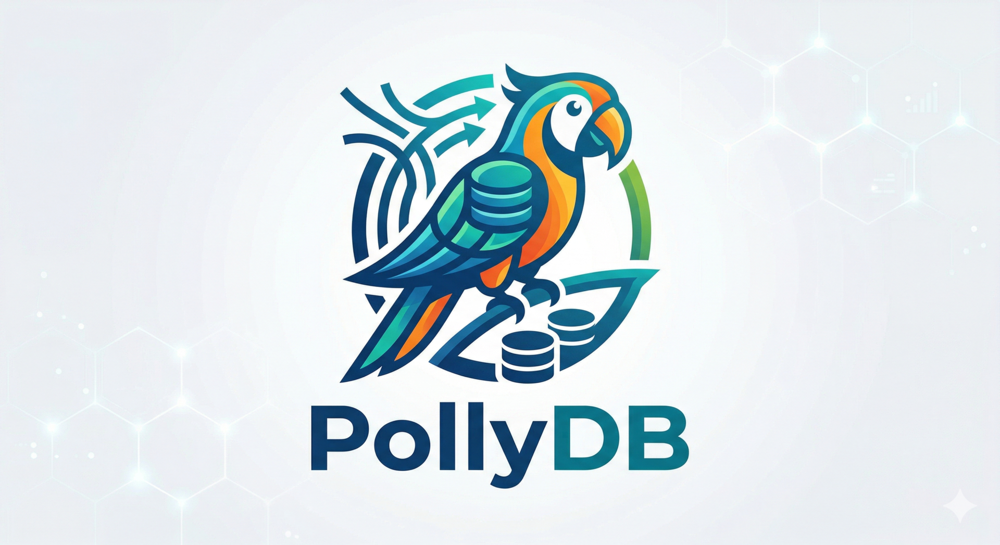

# PollyTree



PollyTree is the home of `pollydb`, a versioned typed database and query engine for structured rows, large text fields, and markdown-backed content.

## What is here

- `storage/`: the `pollydb` storage engine, typed schema layer, query layer, and tree/chunk infrastructure
- `agentview/`: a terminal browser for Codex-style session archives, used as a real-world testbed for query and search performance
- `cmd/pollydb/`: CLI entry points for database operations
- `cmd/agentview_cli/`: CLI entry points for archive import, indexing, benchmarking, and browsing
- `docs/`: design notes, performance roadmaps, and query-layer planning

## Project focus

PollyTree is currently centered on three themes:

- versioned typed storage for application data
- efficient query execution over large local archives
- markdown-aware storage with a general FTS index path for large text and markdown fields

## Recommended entry points

If you are orienting to the current PollyDB surface, start here:

- schema and storage API: [docs/storage_api.md](/Users/guweigang/Source/pollytree/docs/storage_api.md)
- general FTS usage: [docs/general_fts_usage.md](/Users/guweigang/Source/pollytree/docs/general_fts_usage.md)
- planner/query capability introspection: [docs/query_planner_introspection.md](/Users/guweigang/Source/pollytree/docs/query_planner_introspection.md)
- memory reflector roadmap: [docs/memory_reflector_roadmap.md](/Users/guweigang/Source/pollytree/docs/memory_reflector_roadmap.md)
- memory schema capabilities: [docs/memory_schema_capabilities.md](/Users/guweigang/Source/pollytree/docs/memory_schema_capabilities.md)
- CLI-first walkthrough: [docs/tutorial.md](/Users/guweigang/Source/pollytree/docs/tutorial.md)

The current recommended query model is:

- ordinary filters and pagination go through `query_page(...)` / `query-rows`
- lexical retrieval goes through schema-declared general FTS indexes and `QueryRequest.general_fts`
- Markdown selectors remain the preferred model for structural questions such as headings, links, and code-language extraction

In short:

- selectors answer structural queries
- general FTS answers lexical retrieval queries

## AgentView

`agentview` imports local AI session archives into `pollydb`, builds search indexes, and provides a terminal UI for:

- session lists
- transcript browsing
- indexed search

Typical commands:

```bash
agentview sync-codex
agentview index-search
agentview browse
```

`agentview` is also the first real consumer of PollyDB's general FTS path. Its
current search stack uses a schema-declared FTS index on `entries.content_text`
and executes search through the unified PollyDB query path rather than an
application-specific search projection.

## Status

The repository is actively exploring:

- stronger query execution primitives such as covering scans, ordered scans, reverse scans, and top-N access
- split-backed working representations for typed tables
- better search architecture for large text fields and session archives
