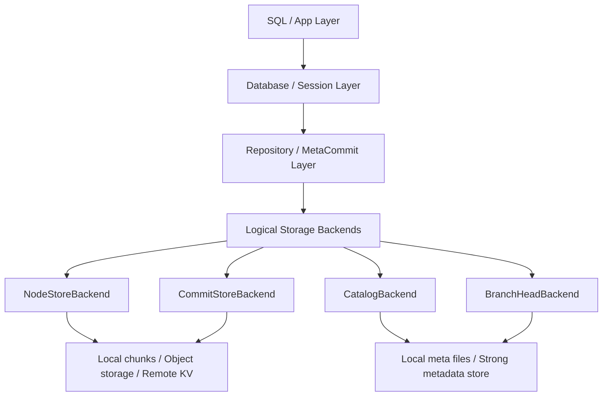
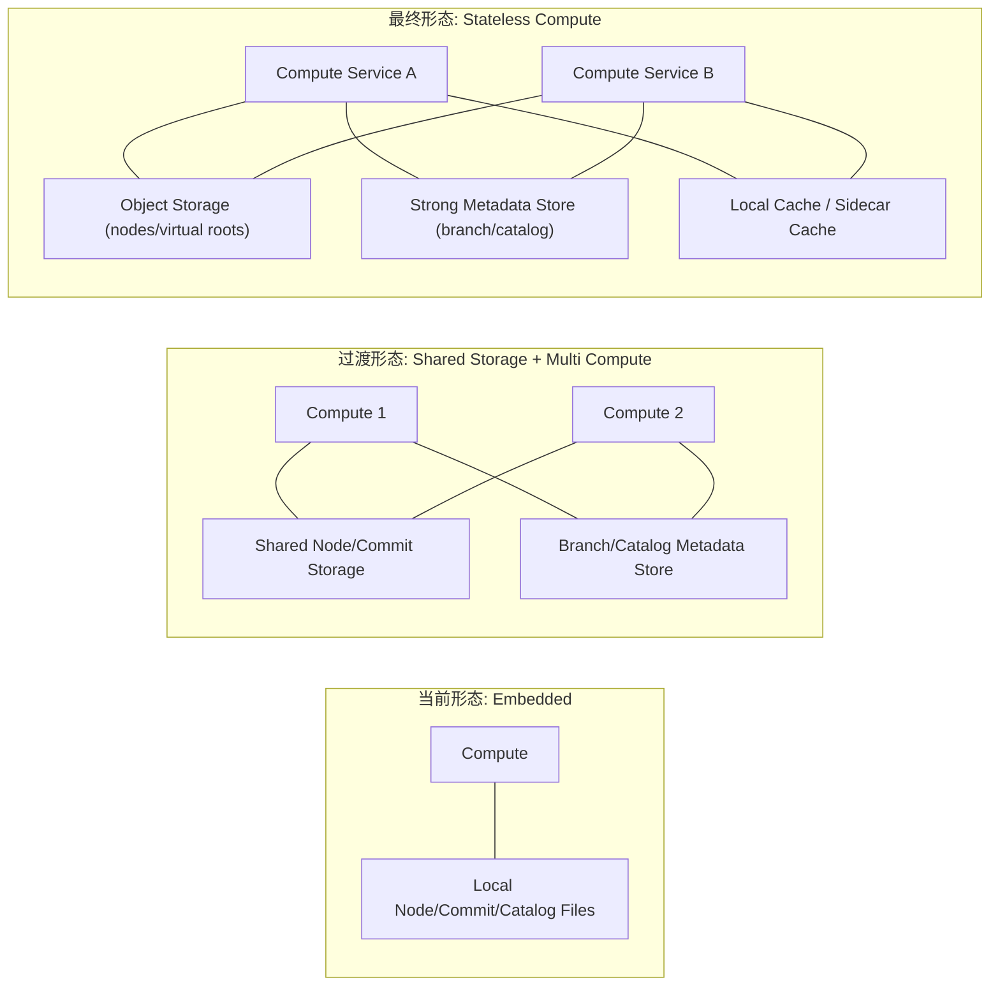
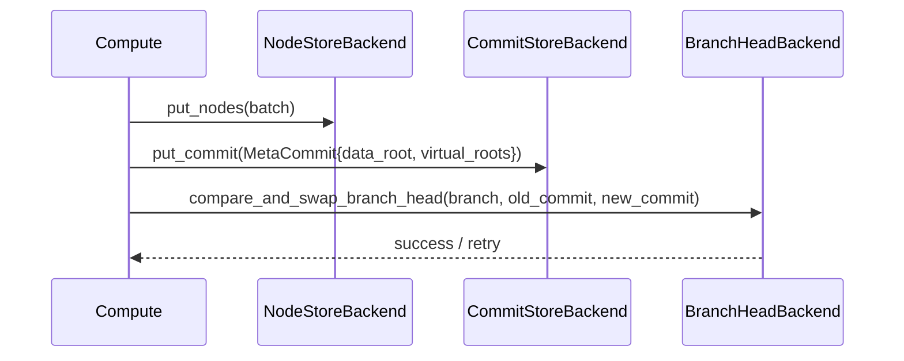
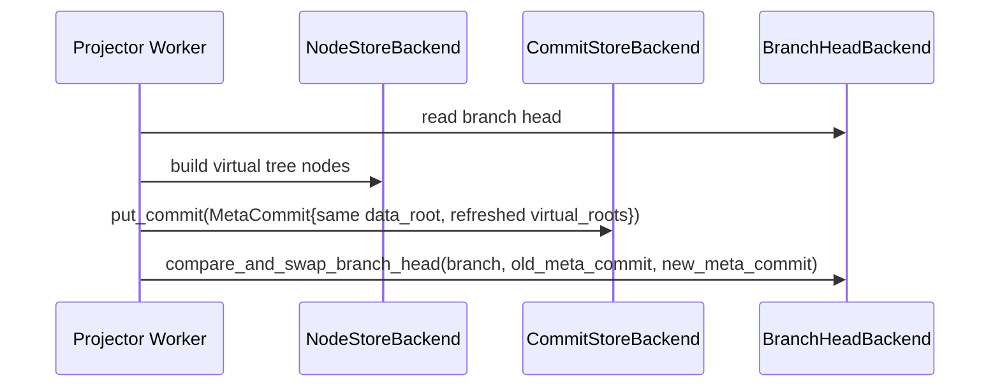

# PollyDB 存算分离演进草案

这份文档描述 `pollydb` 从当前单机嵌入式形态，演进到“存算分离”架构时建议保持的边界、阶段和接口。

## 目标

`pollydb` 的核心优势在于：

- 基于 root hash / commit cid 的快照读取
- Prolly Tree 的结构共享更新
- virtual roots / aggregate projector 的元提交绑定
- 分支、merge、projector、durability 语义已经比较清楚

所以存算分离的目标不应该是“把所有东西拆成远程服务”，而应该是：

- 读取始终围绕 `commit/root`
- 写入始终围绕 `branch head`
- 计算层尽量无状态
- 存储层只提供稳定的数据与元数据边界

## 当前形态

当前 `pollydb` 基本是单机嵌入式引擎：

- 数据节点：`.pollydb/nodes.chunk`
- 提交对象：`.pollydb/commits.chunk`
- 仓库元数据：`.pollydb/repo.meta`
- catalog：`.pollydb/catalog.meta`
- 可选 sidecar / journal / projector 元数据

计算与存储都在同一个进程里：

- `PersistentDatabase`
- `PersistentEngine`
- `PersistentRepository`
- `PersistentNodeStore`
- `PersistentCommitStore`

这种形态的优点是简单、低延迟；缺点是：

- 计算与存储耦合
- 多实例协作边界弱
- 远程共享存储时难以平滑替换 backend

当前代码布局说明：

- 当前实现仍然集中在 `storage/`
- `db/` 和 `core/` 现在是目标迁移层，不是活动代码路径
- 后端接口已经开始抽离，但物理迁移会后置进行，以避免 V 的模块循环风险

## 分层视图



这个分层里最重要的事有三件：

- 应用和 SQL 层永远通过 `Database / Session` 工作
- 一切版本绑定通过 `Repository / MetaCommit` 完成
- 真正可替换的部分是底层 backend，而不是上层查询语义

## 三种部署形态一览



## 推荐演进顺序

### 阶段 1：先抽象存储接口，不改部署形态

先把“本地文件实现”背后的能力收成稳定接口，让本地 chunk/file 只是一个 backend。

最小建议接口：

- `NodeStoreBackend`
- `CommitStoreBackend`
- `RepositoryMetaBackend`
- `CatalogBackend`
- `BranchHeadBackend`

重点不是先远程化，而是先明确哪些操作属于“存储边界”。

### 阶段 2：先读写分离，再做真正存算分离

最稳的中间形态是：

- 多个计算实例
- 一个共享存储 backend
- root-hash snapshot read
- branch-head compare-and-swap write

也就是：

- 读：无锁、按快照读
- 写：只在推进 branch head 时协调

### 阶段 3：对象存储 + 强一致元数据

最终比较自然的拆法通常是：

- 大对象/节点/virtual tree：对象存储
- branch heads / repo meta / catalog：小型强一致元数据存储
- 计算层：无状态或弱状态服务
- 本地：node cache / sidecar cache / projector cache

## 推荐边界

### 1. 数据边界：root hash

读取应始终围绕 `commit cid` 或 `root cid`。

这意味着：

- 查询请求只需要指定一个版本
- 计算节点可以无锁并行读不同版本
- 多版本快照读天然支持

### 2. 协调边界：branch head

真正需要协调的不是节点读取，而是 branch head 推进。

建议把写入边界理解成：

1. 生成新的 `data_root`
2. 生成新的 `virtual_roots`
3. 形成新的 `MetaCommit`
4. CAS 推进 branch head

这使得大部分读取都不需要分布式锁。

对应的推荐写入时序如下：



如果 projector 还没追平，则 `virtual_roots` 可以先带 `fresh=false`。
后续 projector refresh 的时序则是：



### 3. projector 边界：virtual roots

aggregate projector 不应该和主树节点硬绑定。

现在 `MetaCommit` 已经可以同时挂：

- `data_root_cid`
- `virtual_roots[]`

这非常适合存算分离：

- projector 可异步追平
- projector 可单独 stale/fresh
- projector 不阻塞主数据提交

## 推荐接口草案

下面这组接口最值得优先收稳。

### NodeStore

```text
get_node_bytes(cid) -> []u8
has_node(cid) -> bool
put_nodes(batch) -> []cid
```

要求：

- 支持批量写
- 支持按 cid 精确读
- 最好支持对象存储友好实现

### CommitStore

```text
get_commit(cid) -> MetaCommit
put_commit(commit) -> cid
```

要求：

- commit 必须是不可变对象
- `virtual_roots` 必须跟 commit 一起持久化

### BranchHead / RepositoryMeta

```text
get_branch_head(branch) -> commit_cid
compare_and_swap_branch_head(branch, old, new) -> bool
load_repo_meta() -> RepoMeta
save_repo_meta(meta)
```

要求：

- branch head 推进必须支持 CAS
- 这是未来多算节点写入协调的核心点

### Catalog

```text
load_catalog() -> Catalog
save_catalog(catalog)
```

要求：

- schema、projector registry、DDL-like 元信息集中在这层
- 允许与数据节点分离存储

## 三种部署形态

### A. 当前形态：Embedded

- 计算和存储在同一进程
- 所有 backend 都是本地文件

适合：

- 本地应用
- 单机分析
- 开发调试

### B. 过渡形态：Shared Storage + Multi Compute

- 计算层多实例
- 节点和 commit 放共享存储
- branch/catalog/repo meta 放强一致小存储

适合：

- 团队共享
- notebook / 标注 / 在线分析

### C. 最终形态：Remote Object Storage + Stateless Compute

- compute service 无状态
- 节点/virtual roots 放对象存储
- branch head 与 catalog 放强一致元存储
- 本地 cache 做读优化

适合：

- 大规模协作
- 云原生部署
- 真正的存算分离

## 为什么 PollyDB 适合这样演进

因为 `pollydb` 已经具备几个非常关键的前提：

- root-hash snapshot read
- 多版本并行查询
- MetaCommit 绑定 data root 与 virtual roots
- projector stale/fresh 语义
- data-only / full / grouped durability 语义
- sidecar/journal 机制

这意味着后面做存算分离时，很多逻辑不用推翻，只需要把 backend 替换成远程实现。

## 不建议一开始做的事

以下几件事不建议作为第一步：

- 直接把整个 `PersistentDatabase` 改成远程 RPC
- 先做复杂分布式锁
- 先做 SQL 层再补底层 backend
- 让 projector 同步阻塞所有 commit

这些都会把本来已经清楚的存储边界重新搅乱。

## 推荐的第一批实际任务

如果要开始落地，我建议按下面顺序做：

1. 抽出 backend interfaces
2. 给 branch head 加正式 CAS 语义
3. 把 `PersistentNodeStore` / `PersistentCommitStore` 分成：
   - interface
   - local file backend
4. 把 catalog/repo meta 读写也收成 backend
5. 再做一个 mock/remote backend 原型

## 一句话总结

`pollydb` 的存算分离，最关键的不是“把文件搬到远程”，而是：

- 用 root hash 定义数据边界
- 用 branch head 定义协调边界
- 用 MetaCommit 绑定主树和虚拟树

只要这三件事不乱，后面的 backend 和部署形态都可以平滑演进。
